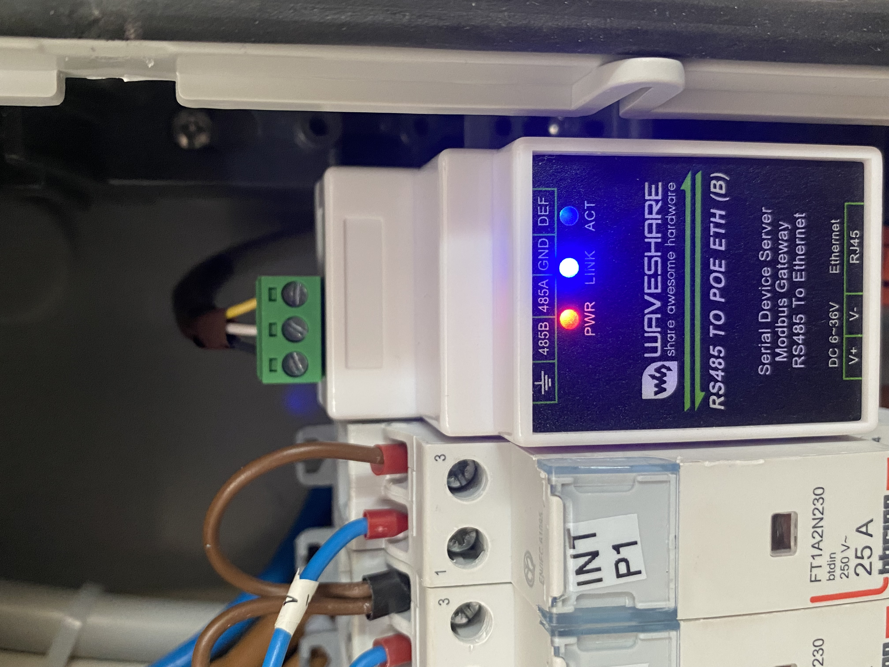
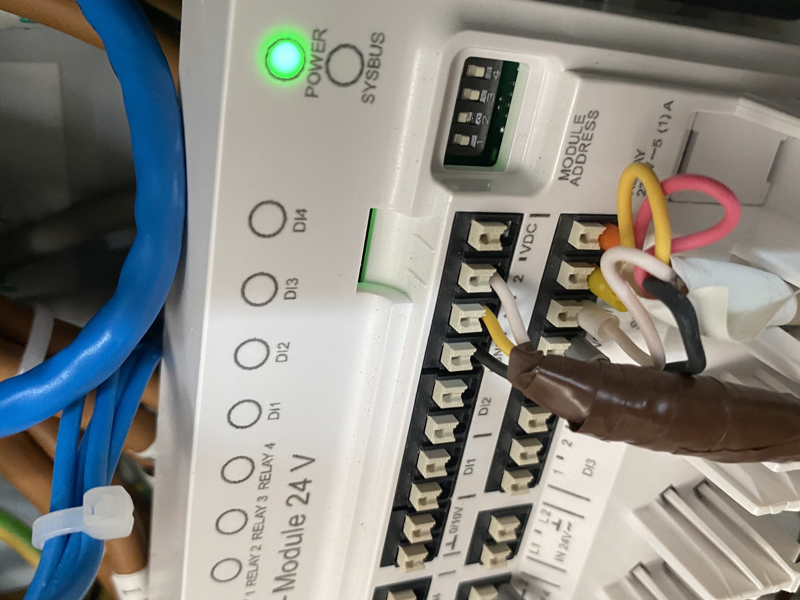
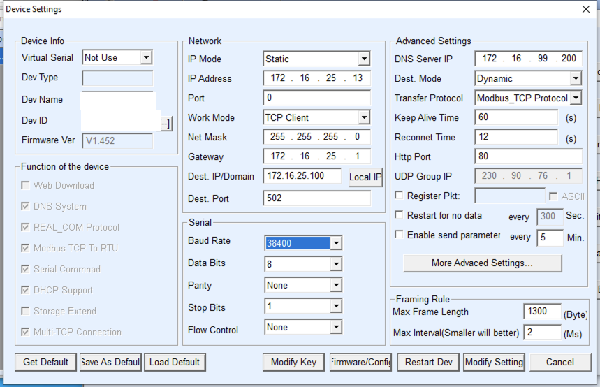
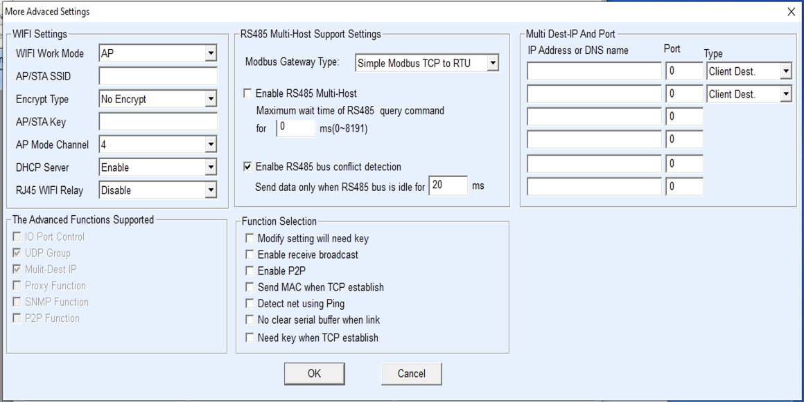

# HowTo: Waveshare RS485 PoE Modbus GW Configuration

# Wiring

The gateway can be potentially powered by the sysbus voltage but this configuration wont be shown here and it's not advised.

The wiring is as follows:

| Rehau Neasmart SYSBUS | Waveshare GW |
|---|---|
| GND | Ground symbol (not GND) |
| 1   | 485A |
| 2   | 485B |

# GW Configuration

Using the waveshare desktop configuration utility VirCOM (the web one doesn't expose all the required parameters) connect to the gateway and configure it with the following data:

- (Optional) IP Address, Netmask, Gateway and DNS server of choice
- Work Mode: TCP Client
- Dest. IP: The IP of the machine running the add-on
- Dest. Port: 502
- Baud Rate: 38400
- Data Bits: 8
- Parity: None
- Stop Bits: 1
- Flow Control: None
- Dest Mode: Dynamic
- Transfer Protocol: Modbus_TCP Protocol
- More Advanced Setting -> Modbus Gateway Type: Simple Modbus TCP to RTU
- More Advanced Setting -> Enable RS485 bus conflict detection: enabled and 20ms

Here the screenshot of the utility with a configured GW:

